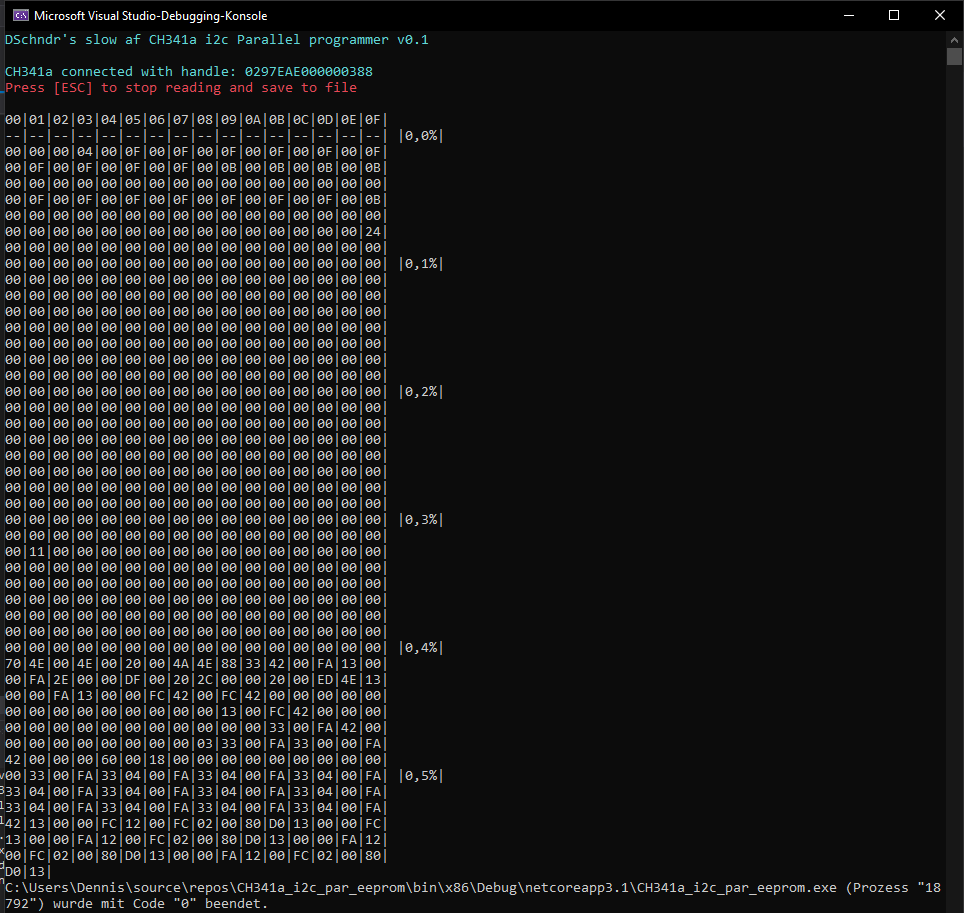
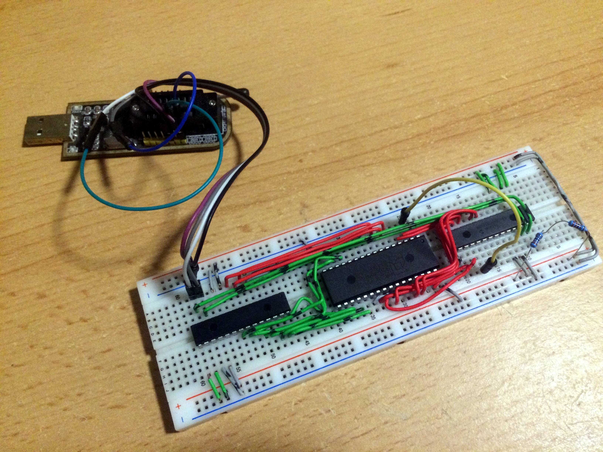

# ch341a_parallelprog
CH341a parallel memory programmer using MCP23017 (i2c)

# How 2 connect / use?
Connect 2 MCP23017(i2c) chips up to CH341a 5V and i2c pins; GPIO pins like in [pins.txt](pins.txt)

Set flashsize in [Program.cs](Program.cs)

Then set platform to x86 in Visual Studio and hit F5 :)
